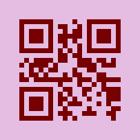

# rqr

A small QR code generation project I made to dip my toes into rust again after several years of absence. I was always curious on how QR codes worked and it was a pretty good project to explore rust with. I followed an [excellent tutorial](https://www.thonky.com/qr-code-tutorial/) to learn of to implement a QR code generator.

I don't plan on maintaining the project or add features to it. Feel free to look at the code to learn or fork it and do something with it.

As with all QR code libs always verify the output before using it for real.

# Examples

## String generation

A simple string representation can be created like so:

```rust
extern crate rqr;
use rqr::{Qr, StringRenderer};

fn main() {
    let qr = Qr::new("HELLO WORLD").unwrap();
    let s = StringRenderer::new().render(&qr);
    println!("{}", s);
}
```

Producing the output:

```
#######....#..#######
#.....#.##..#.#.....#
#.###.#..#.##.#.###.#
#.###.#.#####.#.###.#
#.###.#.##.#..#.###.#
#.....#..#..#.#.....#
#######.#.#.#.#######
........##.##........
.#.####.##..###.##.#.
#.####.#....####.###.
..#.#.##...#..##.....
#.##.#...#.##...##...
##.########.###.#####
........#...#..#.#...
#######..##..##..####
#.....#.#.#..#..#.###
#.###.#.##.#..#...###
#.###.#.#.###...#.#..
#.###.#..#....#....##
#.....#.###..###..##.
#######..#.#.......#.
```

Rendering can be customized:

```rust
let s = StringRenderer::new()
    .light_module(' ')
    .dark_module('X')
    .module_dimensions(2, 1)
    .render(&qr);
```

To produce:

```
XXXXXXXXXXXXXX        XX    XXXXXXXXXXXXXX
XX          XX  XXXX    XX  XX          XX
XX  XXXXXX  XX    XX  XXXX  XX  XXXXXX  XX
XX  XXXXXX  XX  XXXXXXXXXX  XX  XXXXXX  XX
XX  XXXXXX  XX  XXXX  XX    XX  XXXXXX  XX
XX          XX    XX    XX  XX          XX
XXXXXXXXXXXXXX  XX  XX  XX  XXXXXXXXXXXXXX
                XXXX  XXXX                
  XX  XXXXXXXX  XXXX    XXXXXX  XXXX  XX  
XX  XXXXXXXX  XX        XXXXXXXX  XXXXXX  
    XX  XX  XXXX      XX    XXXX          
XX  XXXX  XX      XX  XXXX      XXXX      
XXXX  XXXXXXXXXXXXXXXX  XXXXXX  XXXXXXXXXX
                XX      XX    XX  XX      
XXXXXXXXXXXXXX    XXXX    XXXX    XXXXXXXX
XX          XX  XX  XX    XX    XX  XXXXXX
XX  XXXXXX  XX  XXXX  XX    XX      XXXXXX
XX  XXXXXX  XX  XX  XXXXXX      XX  XX    
XX  XXXXXX  XX    XX        XX        XXXX
XX          XX  XXXXXX    XXXXXX    XXXX  
XXXXXXXXXXXXXX    XX  XX              XX
```

## SVG generation

An svg file can be produced with:

```rust
use rqr::{Qr, SvgRenderer, Color};

fn main() {
    let qr = Qr::with_ecl("HELLO WORLD", ECLevel::Q).unwrap();
    let s = SvgRenderer::new()
        .light_module(Color::new(229, 189, 227))
        .dark_module(Color::new(119, 0, 0))
        .dimensions(200, 200)
        .render(&qr);
    println!("{}", s);
}
```



## Customize QR values

You can override inferred QR code defalts by interfacing against the builder. Normally you should only specify the error correction level, the other values are inferred optimally.

```rust
let qr = QrBuilder::new()
    .ecl(ECLevel::L)
    .version(Version::new(3))
    .mask(Mask::new(0))
    .mode(Mode::Alphanumeric)
    .into("1234567890")
    .unwrap();
```

It's possible to gain even more fine grained control, like adding raw bits, both via the builder or against the matrix directly.

## CLI

There's a simple cli you can use.

It uses optional dependencies to avoid arg parser dependencies to the library, so you need to build it with the flag `--features cli`.

For example to pretty print a QR in a terminal:

```
> cargo run --features cli -- "HELLO WORLD"


        ██████████████        ██    ██████████████        
        ██          ██  ████    ██  ██          ██        
        ██  ██████  ██    ██  ████  ██  ██████  ██        
        ██  ██████  ██  ██████████  ██  ██████  ██        
        ██  ██████  ██  ████  ██    ██  ██████  ██        
        ██          ██    ██    ██  ██          ██        
        ██████████████  ██  ██  ██  ██████████████        
                        ████  ████                        
          ██  ████████  ████    ██████  ████  ██          
        ██  ████████  ██        ████████  ██████          
            ██  ██  ████      ██    ████                  
        ██  ████  ██      ██  ████      ████              
        ████  ████████████████  ██████  ██████████        
                        ██      ██    ██  ██              
        ██████████████    ████    ████    ████████        
        ██          ██  ██  ██    ██    ██  ██████        
        ██  ██████  ██  ████  ██    ██      ██████        
        ██  ██████  ██  ██  ██████      ██  ██            
        ██  ██████  ██    ██        ██        ████        
        ██          ██  ██████    ██████    ████          
        ██████████████    ██  ██              ██          


```

Or to generate an svg:

```
> cargo run --features cli -- "HELLO WORLD" -t svg --bg '#e5bde3' \
    --fg '#700' --width 200 > hello_world.svg
```

This [outputs the same](#svg-generation) as the above example svg code.


# Tutorial feedback

Errors in the tutorial:
* Bitwise repr of dec 16
* Dark module coordinates have x and y swapped
* Dark module is marked to be added in both module placement and format & version information sections.

Minor improvements suggestions:
* Note which QR is the mask evaluation based on?
* Maybe I did miss this somewhere, but I first implemented dark as 0,
  but it's supposed to be dark as 1.

